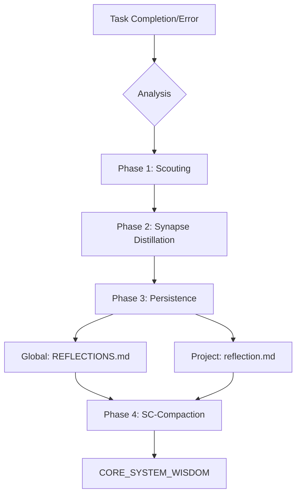

# 🧠 Adaptive Learning: Synapse-Compaction (SC)

This skill implements a high-signal, token-efficient memory system. It separates 'Active Learning' (full context) from 'Core Wisdom' (distilled directives) to minimize token bloat while retaining 100% of learned signal.

## 🏗 The Synaptic Loop



---

## 🔬 Phase 1: Session Analysis

Identify patterns with **100x Efficiency**. Focus on:
1.  **Problems & Solutions**: Root causes (Win-pathing, API quirks).
2.  **Architecture Shifts**: Component relationship changes.
3.  **User Preferences**: Explicit style or workflow mandates.

---

## 🧪 Phase 2: Synapse Distillation

Every entry must be written for **LLM Grokking**, not human leisure. 

> [!IMPORTANT]
> **The LLM-Signal Rule**
> Use precise, technical jargon. Prefer tags over sentences.
> Instead of: "The user likes when we use backslashes on Windows because of cmd errors."
> Write: `RULE: Always use \ for paths. Cause: Cmd/Powershell tokenization errors.`

### Output Structure (Active Memory):
```markdown
<syn id="ID" date="DATE" type="PREF/ERROR">
OBJ: [Target goal]
CAUSE: [Root why]
RULE: [Directive for future runs]
</syn>
```

---

## 💾 Phase 3: Persistence & Compaction

Knowledge persistence is managed via an **External Deterministic Script**. This ensures uniformity without extra LLM token usage for file management.

```powershell
# Usage: harvest.ps1 -Id "ID" -Obj "Goal" -Cause "Why" -Rule "Directive"
./scripts/harvest.ps1 -Id "WIN-PATH" -Obj "Scouting" -Cause "Token bloat" -Rule "Use exa/grep"
```

### 🧊 Internalization (SC-Compaction)
When `Active Memory Buffer` exceeds 5 items, the `harvest.ps1` script automatically triggers `compact_memory.ps1`.
1.  **Oldest Synapse** is extracted.
2.  **RULE** is appended to `# [CORE]` section.
3.  **Detailed Context** (OBJ/CAUSE) is deleted to free brain/context window capacity.

---

## 📂 Resources

- **[Compactor Script](file://./scripts/compact_memory.ps1)**: Logic-level internalization (No API calls).
- **[Harvesting Script](file://./scripts/harvest.ps1)**: Front-end buffer management.
